===================================
Suricata Extreme Performance Tuning
===================================

(with incredible courage along...)

Introduction
============

The work on this guide was triggered thanks to SuriCon 2016.

|

This guide represents and comprises our findings during the high performance 
tuning endeavor we embarked to do 20Gbps IDSing with Suricata on commodity/COTs 
hardware. 

Over the years, there has been quite a few questions/speculations and ideas of how to get the 
best performance out of Suricata and under what conditions is that possible and
with what hardware.

This guide tries to address a `ground up` approach and to emphasize and describe
the first necessary steps for high performance tuning of Suricata IDS.

Suricata's performance has 4 major variables:

* Suricata version
* Traffic type
* Rules used
* HW capability

Not to underestimate at all though is the OS type/kernel version/NUMA-NIC location/
CPU L3 cache when we want to take performance to the next level. Those are 
described in more detail later in this paper. The most important part to understand
and tackle is that a packet has a number of hops to jump before it gets to 
Suricata for further processing.

Our set up
----------

* Up to 20Gbit/sec traffic in a long and sustained peaks. Around 2 000 000 pkt/sec.
* Suricata 3.2dev (effectively 3.2) 
* HP ProLiant DL360 Gen9
* 2x dual port X710 and X520 - one port on each card used. Cards installed into separate NUMA nodes.
* Ixgbe-4.4.6 from Intel, e40i drivers from Intel, not from a kernel.
* RSS disabled, single queue per card to avoid packet reordering  
* 4.4.0-38-generic #57~14.04.1-Ubuntu and higher. Lower versions have an `AF_Packet bug <https://git.kernel.org/cgit/linux/kernel/git/davem/net-next.git/commit/?id=eb70db8756717b90c01ccc765fdefc4dd969fc74>`_ - we will cover that in more detail later in the paper.
* 21332 rules enabled from ET Pro, 10490 inspecting South-North and 10842 inspecting also internal traffic (and external, too).
* 128GB RAM, 8 DIMMS, 4 per socket.  
* 2x Intel(R) Xeon(R) CPU E5-2697 v3 @ 2.60GHz - 28 cores total, HT enabled and used for 56 hardware threads. Haswell is recommended, Sandy Bridge is a minimum.

We ended up not needing all the resources of such a big system for 20Gbps inspection.

The grand plan
===============
Our grand plan could be summarized like this - use CPUs L3 cache as a data bus. 

|

Hence a major requirement for reproducing the results of this paper is to have 
CPUs that have L3 cache. (E5s for example)

What we meant by that is, let your card push packets directly into the L3 on each 
socket and when the kernel and Suricata later want to process this packet, 
it’s already in the L3, fresh, warm and ready to be used.
As we move along in this paper you will see that the majority of our efforts has been spent on making 
sure the above is true and packets are not evicted from a cache before being 
used/processed.

Why do we pay so much attention to the CPU L3 cache?
----------------------------------------------------

When you CPU wants to process data, it needs to read it first. It can read it 
from multiple places - various levels of caches, memory buffers, then a RAM 
itself. Each time it tries to fetch that data and it cannot find it quickly, a 
CPU stall (execution wait) occurs. That means wasted cycles, your CPU spins up 
doing nothing and waiting for the needed data to be fetched from another place - 
RAM for example. It introduces a non efficient/streamlined CPU usage.

Over this research, we measured the IPS - Instructions Per Second, using the `Intel Performance Counter Monitor tool <https://software.intel.com/en-us/articles/intel-performance-counter-monitor>`_. 
On a modern CPU you want this number to be as close to 4 as possible. 
We went from 0.7 IPC (when CPU was waiting for data a lot) to 2.7 in our highly tuned environment.

Examples of access latency depending on where a data is - numbers are approximate,
Home Snoop mode, you can shave a few nanoseconds here and there with 
Early Snooping:

* Local L3 CPU cache - 20ns 

Data located on the L3 cache on the same NUMA node as the CPU processing it.

* Remote L3 - 80ns 

Data located on the L3 cache on the remote NUMA node in relation to the
CPU processing it.

* Local RAM - 96ns 

Data located in the RAM residing on the same NUMA node as the CPU processing it.

* Remote RAM - 140ns 

Data located in the RAM residing on the remote NUMA node in relation 
to the CPU processing it.

|

Interesting observations
~~~~~~~~~~~~~~~~~~~~~~~~

It takes almost 5 times longer to fetch data from RAM than from a local L3 cache.
Not trashing a cache is crucial. It takes almost as long to fetch data from 
remote L3 cache as it takes from a local RAM. NUMA locality is important.

You have between 65 to a couple hundred nanoseconds to process a single packet 
when dealing with tens of gigabits per second networks.

With the smallest possible cache 
misses we can achieve the achieve smooth packet processing from end to end 
without read/fetch delays that can result in packet loss thus impacting Suricata 
IDS/IPS inspection.

How we did it
-------------

- Dual CPU server and all DIMMS per socket of the same size. Needless to say, if you have four memory channels per socket, you must use 4 DIMMS.

- Two network interfaces, on a separate cards, one card for each NUMA node. NICs RSS, MQ, FDIR, ATR stay disabled to help avoid packets reordering by FDIR (flow director).

- Isolate all cores from any tasks and use core 0 thread 0 as a housekeeping core. Yes correct - isolate cores so that the no tasks run on them except the work done by Suricata.

- Isolate hardware IRQ processing and software IRQ processing and AF_Packet and pin it all on a dedicated core - one per card/NUMA node. All of above tasks can usually be handled by a single core. Nothing else runs on this core.

- Finally we run Suricata pinned to the "leftover" isolated cores. Card 0 sends packets to node 0 where they are treated from start to end, card 1 sends packets to node 1. We used Suricata in workers mode to have one flow treated on the same core and thread from start to end.

- Every buffer, ring, descriptor structure is kept as small as it can be to avoid buffer bloat and make sure it stays in a CPU cache (our lifeline).

Life of a packet
----------------

An ideal world. A life of a packet:

1. Packet is on the wire. Card fetches it into a FIFO queue.

|

2. Card sends both the packet descriptor and a packet itself to a L3 cache of 
a CPU that card is connected to.

|

3. At some point a write back happens of that data to a host memory on the 
same NUMA node. At this point the packet is in one of free buffers. And this is what 
people call “hardware buffers”. There’s no hardware buffer on the card, other 
than the FIFO queue. We will also call the area of memory that the card writes packets to a "DMA area".

|

4. Card sends or does not send an interrupt to let Linux know it should start 
pooling packets with NAPI. Linux acknowledges that interrupt, if it 
was raised and goes back to NAPI polling. Everything happens on a core dedicated for 
interrupts.

|

5. NAPI fetches the packet from a DMA area (a ring buffer, 
see 2 and 3 above) which results in L3 hit and into SKB by doing magic 
tricks with the underlying memory pages. Driver reuses half of either the same 
page or allocates a new one to replace a used one. NAPI delivers packet to subscribers, 
like AF_Packet. We are still on the “interrupts core”.

|

6. AF_Packet calculates hash and puts the packet in a buffer for a corresponding 
worker thread on a different core on the same CPU, resulting in L3 hit. 
TPacket V3 (AF_Packet V3 in Suricata) works hard to avoid data copying.

|

7. Every now and then, Suricata worker switches to processing a next block full of packets 
in a ring, with a simple pointer mathematics, without issuing a single system
call or doing copies. The mechanism has been designed to amortize the amount of work 
to be done per packet - that is why they are accessed by Suricata in batches.
After Suricata is done with a packet, it marks it so AF_Packet can reuse the underlying page. 
It does that without migration between user space and a kernel space. 
This is hugely important for performance. Suricata does not have its own buffer for packets - 
the kernel buffer is shared with userspace.

|

This can be summarized like this:

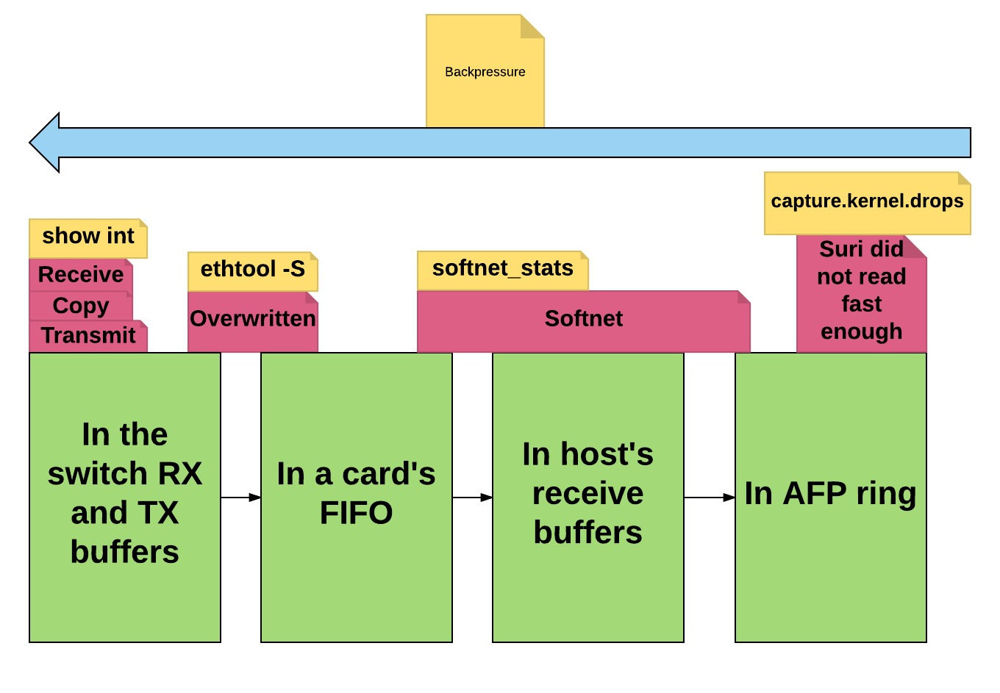

Common misconceptions about AF_Packet
-------------------------------------

 - AF_Packet is slow.
 
 With TPacket V2 and especially TPacket V3 one can go way beyond 20Gbit/sec on 
 a single physical server. We believe 40Gbit/sec is possible, we simply did 
 not have enough traffic!! Get us the traffic to test on :) if you don't believe it.
 
 - AF_Packet means there is an interrupt per packet and 10Gbit/sec is like 14Mpps.
 
 First, your traffic is a mix and the average frame size is around 900-1000 bytes
 so you don’t need to service 14Mpps. 
 Second, we observed that the NIC works most of the time with interrupts disabled, we
 explained it below.
 
 - Linux kernel copies packets around, a few times per packet. 
 
 Countless hours were spent during this research to understand a packet path from 
 the wire to Suricata. We can say that Linux networking stack is impressive 
 (the very least). It avoids copying packets unless doing a copy is cheaper than 
 moving pointers around, for example when a packet is smaller than a SKB (socket buffer) 
 header.
 
 - Specialized cards are necessary as they avoid copying packets, interrupts, system calls, transitions between user and kernel space that Linux does per packet. 
 
 Interrupts are not a problem anymore and a correctly configured Linux system is 
 great in avoiding most of that list. It is as close as it can be to card DMA-ing 
 packet right into L3 on the CPU where a packet will be consumed. Actually some 
 of those specialized cards cheat and do a bunch of work on a host CPU, a work 
 that is hidden with binary kernel modules. For example, Myricom calculates 
 RSS on all your cores. Some cards indeed can do most of the work (and then some) 
 in hardware, but you are looking at 10 - 25 000 USD. Buy more servers instead. 
 And those hardware capabilities have tons of non-obvious limitations, most of 
 them cannot be helped with a software upgrade. And you can change your 
 Linux kernel at any time :)
 
Tuning steps
=============

In our set up we decided to `hardcode` cores to certain duties to avoid cache 
thrashing and making sure our assumptions are correct most of the time. Here 
is how it works:

- Cores 0 and 14 - housekeeping cores. One per NUMA node. They are nothing special, just the first thread from the first core of the first CPU and the first thread of the first core from the second CPU.

It does nothing but generic OS duties, not directly related to our workload. 
Things like ssh or audit or various kernel threads run here. Timekeeping is also 
done on this core. Suricata flow managers threads run here as well.

- Cores 1 and 15 - hardware and software parts of IRQ processing runs here as well as most of AFP.

This core will switch frequently between a user space and a kernel space. Since 
it’s the most loaded pair of cores we advise against running anything on the HT peer.

- Leftover cores.

They run Suricata workers. 
As depicted below:

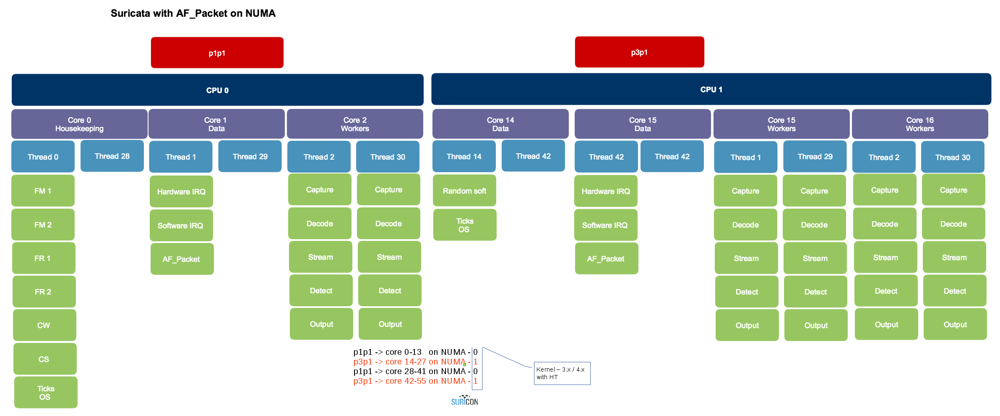

Hardware
--------

Let’s start with the basics. Use one network card per NUMA node.
Single CPU is OK, as is dual CPU. Do not go beyond two CPUs - these platforms 
scale poorly. Buy 2 or 4 servers instead of one with 4 CPUs. It is also cheaper.

Use Intel E5 processors, even for a single CPU configuration. Ideally Haswell 
or later. They have L3 cache that E3 do not and that cache is a critical piece 
of a performance. Do not buy E7, there is no reason for that. While they have 
more cores, but due to a ring architecture it does not scale that well. Plus 
they are expensive (and so are servers that accept them) - buy two E5 servers 
instead.

Use the fastest memory you can buy. Have one DIMM per channel, avoid 2 or more 
DPC (Dimm per channel) and make sure you use all memory channels. Yes, it is 
more expensive to buy 8x 16GB then 16x 8GB, but with the later, memory access 
latency goes up and the frequency and throughput goes down.

Use either Intel X710 (recommended) or Intel X520 card. Mellanox cards look 
interesting as well, we have not tested them.

Make sure each card goes into a separate NUMA node and is connected to a PCIe 
slot that has at least x8 Gen 3.0 to root. Avoid installing anything else in 
any extra slots.

Where is my NUMA
----------------

Install the `hwloc` package and create some pretty graphs. Make sure `acpi slit` 
is enabled in BIOS/EFI (see below).

On Debian/Ubuntu like systems::

 apt-get install hwloc

Give it a try::

 lstopo --logical --output-format txt

For ascii art use above, if you have it build with libcairo support you can do::
					
 lstopo --logical --output-format png > `hostname`.png

To see which NUMA node your card is connected to::

 cat /sys/class/net/<INTERFACE>/device/numa_node

To see a list of cores and where they belong::

 cat /sys/devices/system/node/node[X]/cpulist

To see per interface or PCI function::

 cat /sys/class/net/[interface]/device/numa_node
 cat /sys/devices/[PCI root]/[PCIe function]/numa_node
 
Firmware. EFI. BIOS.
--------------------

- Disable IOMMU (input–output memory management unit)

It provides little security, some functionality that is not of any use in our 
case and creates a huge latency problem for all memory operations.

- Disable ASPM (Active State Power Managemen) and QPI(QuickPath Interconnect) power management and similar PCIe power saving states. 

We are talking tens of Gigabits per second here, millions of packets. Your 
cards will be busy. ASPM (contrary to C-states) has a bad reputation and likes 
to make the PCIe bus “go away” at the worst possible moment. Your card wants 
to transmit a packet to the ring buffer from FIFO, as the FIFO is getting full?
Ups, there is no PCIe for a moment. Packets are overwritten. Same for QPI power 
saving - little benefit and we need that QPI to be active all the time.

- Disable VT-x and VT-d and SR-IOV. 

You will not use them, sometimes it is hard to understand what they silently enable 
and what kind of workaround kernel will enable when it sees them - and they increase 
attack surface.

- Disable Node Interleaving.

Leave channel interleaving enabled. You want your locally allocated memory to stay
local and not be allocated on two NUMA nodes at the same time.

- Enable IOAT - Intel I/O Acceleration Technology (DDIO - Data Direct I/O Technology , DCA - Direct Cache Access).

Technically, DDIO is part of a greater IOAT “features package”. It consists of two parts:

* An accelerated copy by a dedicated DMA engine (think a hardware accelerated memcpy() ) - it is not used by a network stack because it has a huge latency
* DDIO - makes your card send packets directly to L3 caches. And that's what we want.

- Disable some types of prefetching.

Most prefetching mechanism work in a shotgun-like mode, prefetching everything 
in sight, flushing cache and being wrong with what it thinks is needed next. 
DDIO will be doing that.

Here are the kinds of prefetchers we disabled:

* HW prefetcher
* Adjecent sector prefetch
* DCU stream prefetcher

- Leave C-states and P-states enabled. 

Kernel will likely overwrite your decision anyway. You will see later why we need them. 

This is how it is done on HP hardware/server:  

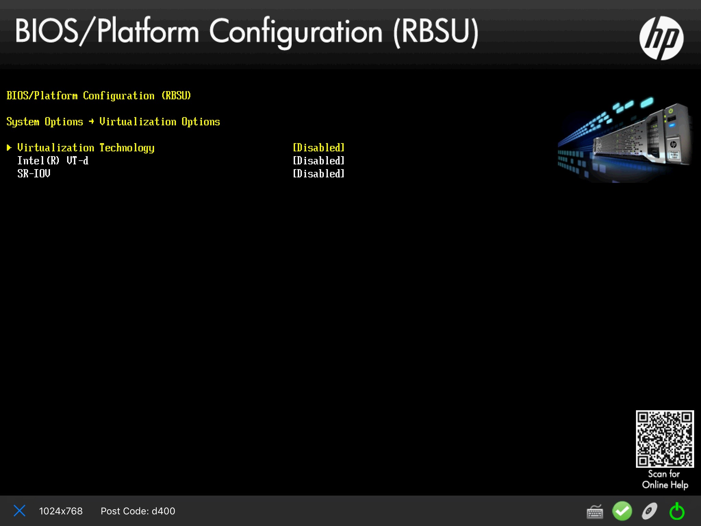

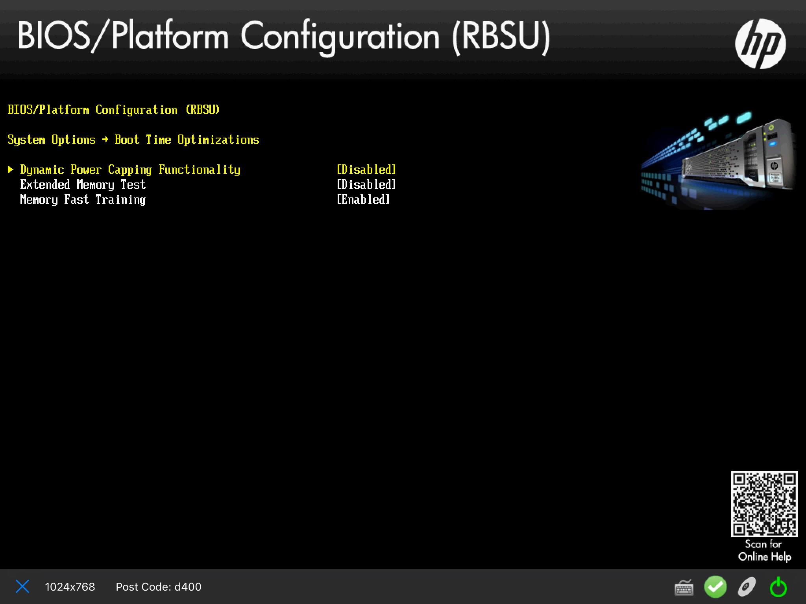

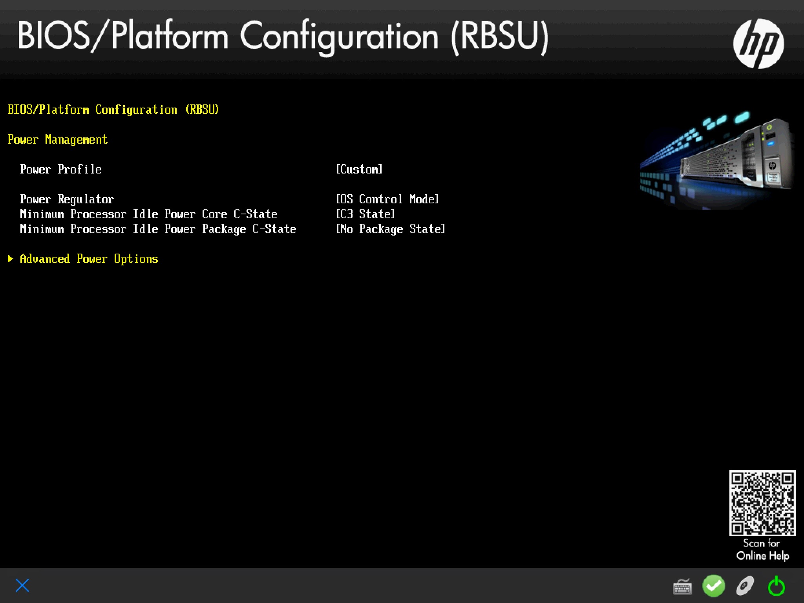

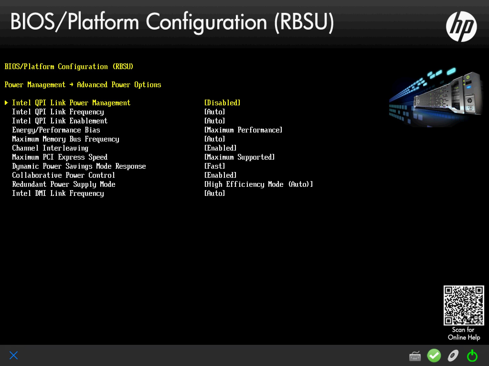

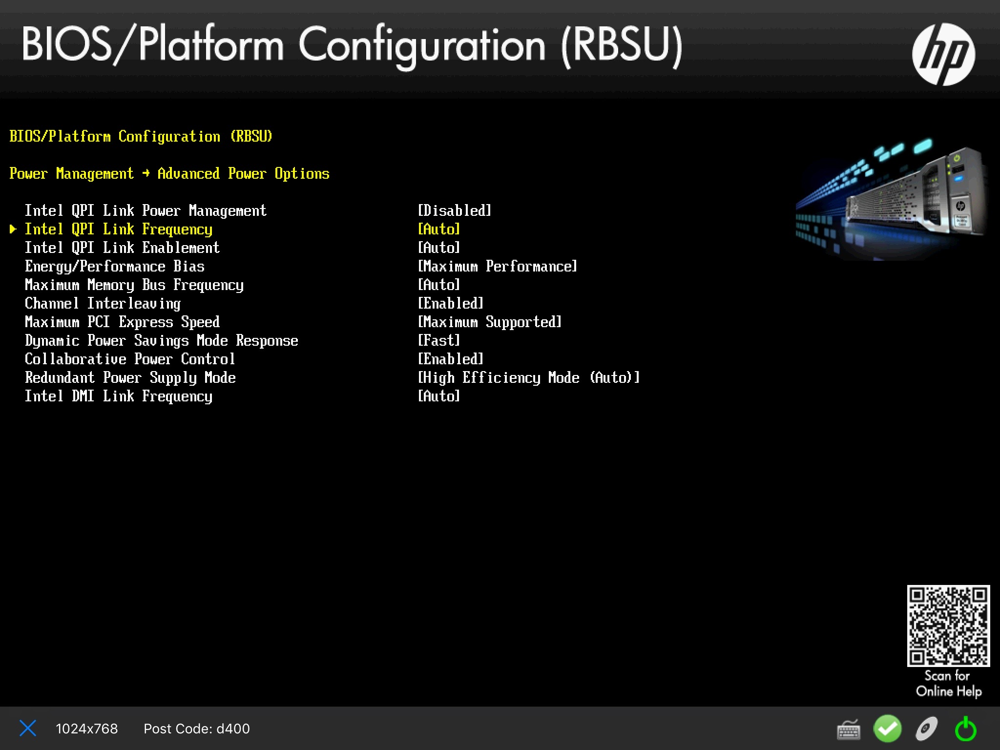

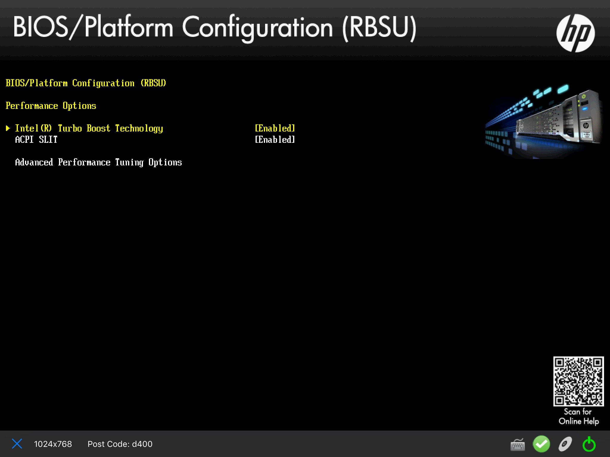

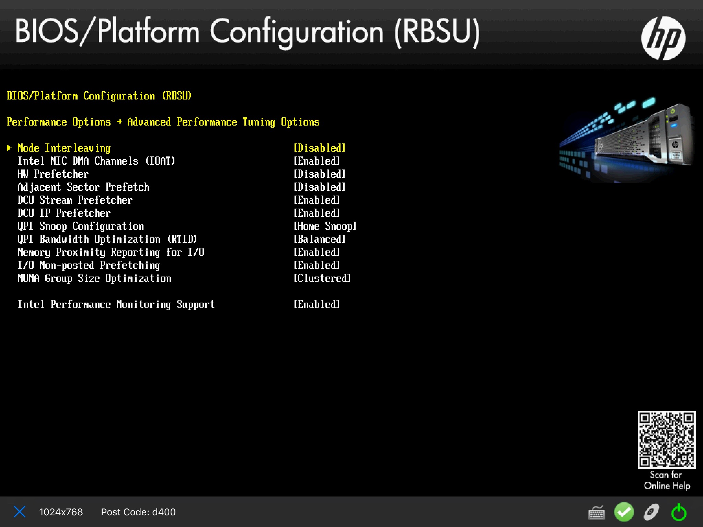
    

AF-Packet symmetric hash
------------------------

For some kernel versions there is a bug with regards to symmetric hashing as 
described in the `commit that fixes it <https://git.kernel.org/cgit/linux/kernel/git/davem/net-next.git/commit/?id=eb70db8756717b90c01ccc765fdefc4dd969fc74>`_.

We strongly advise you to first verify your kernel is free of the bug using the excellent 
`verification tool <https://github.com/JustinAzoff/can-i-use-afpacket-fanout>`_ 
from Justin Azoff (the Bro IDS project).

The problem is best `explained here <http://suricata.readthedocs.io/en/latest/performance/packet-capture.html>`_ and depicted like so below:  

.. image:: images/streaming.png
    :alt: Asymmetric hashing impact
    :align: center
    :width: 80 %

Kernel <=4.2 or 4.4.16+, 4.6.5+ or 4.7+ are safe. To be sure the issue 
does not exist on your kernel version you can use the verification tool above.

Remove applications that can have unintended effect
---------------------------------------------------

- IRQbalance 

It is trying to balance interrupts among cores, shifting affinities all the time
and in turn ruining our careful setup. Just remove it, do not relay on 
whitelisting anything.

- Dhcpd, dhclient, dhcprelay, lldpd, iperf and similar software

Some of them open a AFP socket through libpcap in a mode that makes entire AFP 
processing path shift so it’s much less efficient. Do `ps -ef` and see what you 
can remove - do not run any application(s) that is not strictly necessary.

Correct NIC driver with correct parameters
------------------------------------------

As we said previously, the multiqueue NIC functionality leads to packet reordering.
You can check with `ethtool -l eth0` for example. Multiqueue, RSS, Flow Director 
and Application Targeted Receive have never been designed for IDS/IPS, but rather 
for scaling workloads like a web or a file server. In those circumstances they excel.
For IDS/IPS they must stay disabled.

Disable everything that can be disabled. The ITR number below worked well for 
us and might have to be be tuned by you. Each parameter has 4 values since there were 
4 ports on the system.
::

 modprobe ixgbe MQ=0,0,0,0 RSS=1,1,1,1 VMDQ=0,0,0,0 \
 InterruptThrottleRate=12500,12500,12500,12500 \
 FCoE=0,0,0,0 LRO=0,0,0,0 vxlan_rx=0,0,0,0
 modprobe i40e

On i40e card most of these settings are not longer managed with driver’s module parameters but with ethtool. 

To enforce a single RX queue on X520 and X710: ::

 ethtool -L <interface> combined 1

Verify with: ::

 ethtool -l <interface>

and ::

 cat /proc/interrupts | egrep <interface> 

and see if you have a single line for the combined RxTx interrupt, similar to these: ::

 p2p1-TxRx-0
 i40e-p3p1-TxRx-0

And that there is no -1, -2, -3, etc.

With ixgbe take a look at the kernel log: ::

 dmesg | egrep ixgbe

Look for lines like these: ::

 [	9.200226] ixgbe 0000:04:00.0 eth0: \
 Enabled Features: RxQ: 1 TxQ: 1 DCA
 
 [	9.220935] ixgbe: Multiple Queue Support Disabled
 
 [	9.220940] ixgbe: Receive-Side Scaling (RSS) set to 1

For i40e: ::

 [493063.749599] i40e 0000:82:00.1: RSS count/HW max RSS count:  1/64

There might still be other similar interrupts, for various card’s functions 
we don’t use, like management or virtualization, these can be safely ignored.

A handy dictionary for this section:

* MQ - multiqueue. We use a single queue only so packets will be processed by a single core
* DDIO - card will pre-warm lowest level cache with packet descriptor and packet data. This means, by the time kernel wants to fetch packet, it’s already in L3 and does not have to be copied later.
* VMDQ - Virtual Machine Device Queues. Clouds just don't mix with a high performance environment.
* InterruptThrottleRate - keep hardware interrupts under control. We tuned it later from OS, so this is mostly to show one of many ways.
* FCoE - Fibre Channel over Ethernet. We do not care so we disabled it.
* LRO - must be disabled along with every other offloading function, so IDS can see packets as they are. If enabled, card merges packets into one giant packet and sends that to rings, to avoid copying overhead. Unfortunately this prevents IDS from reassembling flows correctly - someone said “LRO merges everything in sight”
* Vxvlan_rx - we do not use so we disabled it.

Note that there is no DCA since is an older technology, replaced by DDIO now. 
With DCA, driver had to manage prefetching packets into L3 cache while DDIO 
does it automatically. The only advantage DCA has is it can send packets to L3 
cache of a remote NUMA node while DDIO always sends to a local node. If that is 
a problem just correct your CPU pinning or move cards around.

If your hardware supports DDIO, it’s enabled by default. Sandy Bridge and up 
does that automatically with Intel cards. For other vendors - check with a vendor.

Managing interrupts
-------------------

We don’t want a card to send us too many hardware interrupts. Remember, the only 
thing they do is they kick NAPI processing loop so it starts processing packets. 
Since we are aiming at high speeds -  NAPI will be running most of the time anyway
subject to internal mechanisms to avoid starvation, not that important when we 
isolated processing to a set of cores.
::

 ethtool -C p1p1 adaptive-rx on rx-usecs 100
 ethtool -C p3p1 adaptive-rx on rx-usecs 100

While there are tons of interrupt management switches in the ethtool, modern 
network cards silently ignore almost all of them. A settings like these will 
enforce a gap between two consecutive interrupts. In other words, they 
will limit the maximum number of interrupts per second.

Lower the NIC ring descriptor size
----------------------------------
::

 ethtool -G p3p1 rx 512
 ethtool -G p1p1 rx 512

Why? Lowering it from 4096 made the DDIO work - L3 cache miss ratio went down 
from 16% to 0.2% on the core handling IRQ (soft+hard) and 0.46% for Suricata 
worker threads cores. This means packets were transmitted by the L3 cache. 
There was no impact on L1 and L2 cache.

Smaller buffers mean interrupts should run more frequently, so we lowered the 
threshold time during which card cannot issue an interrupt, from 80 to 20 usecs. 
It did not lead to increase CPU usage, since majority of time is spent in 
softirq with hardware interrupts disabled.

Cache misses
------------

Effects of ring descriptor size on DDIO and L3 hits.
Measured on the core handling software and hardware interrupts.
Ring descriptor size 4096 buffers. Each buffer is 2048 
bytes in size::

 perf stat \
 -e LLC-loads,LLC-load-misses,LLC-stores,LLC-prefetches -C 1

 Performance counter stats for 'CPU(s) 0':

 1939117135  	LLC-loads                                      	(66.67%)
 289305806  	LLC-load-misses	#   14.92% of all LL-cache hits (66.67%)
 356341541  	LLC-stores                                     	(66.67%)
 <not supported>LLC-prefetches

 	114.342786481 seconds time elapsed

Ring descriptor size 512 buffers. 
Measured on the core handling software and hardware interrupts.
Each buffer is 2048 bytes in size::

 perf stat \
 -e LLC-loads,LLC-load-misses,LLC-stores,LLC-prefetches -C 1 sleep 60

 Performance counter stats for 'CPU(s) 1':

 659135009  	LLC-loads                                      	(66.67%)
 1372230  	LLC-load-misses	# 0.21% of all LL-cache hits 	(66.67%)
 124004599  	LLC-stores                                     	(66.67%)
 <not supported>LLC-prefetches      	 

  	60.001419120 seconds time elapsed

Measured on the core handling Suricata worker thread::

 perf stat \
 -e LLC-loads,LLC-load-misses,LLC-stores,LLC-prefetches -C 10 sleep 60

 Performance counter stats for 'CPU(s) 10':

 1981142209  	LLC-loads                                     	(66.66%)
 9128245  	LLC-load-misses	# 0.46% of all LL-cache hits 	(66.67%)
 62828203  	LLC-stores                                     	(66.66%)
 <not supported>LLC-prefetches

  	60.006355454 seconds time elapsed

L3 cache became a transmission bus between card and Suricata. Notice how the 
`LLC-load-misses` went down from 14.92% to 0.21% on core handling kernel side of packet processing.

Disable pause frames
--------------------

Pause frames will mask certain counters (they will never go up) and lead to 
inaccurate drop statistics ::

 ethtool -A p1p1 rx off tx off
 ethtool -A p3p1 rx off tx off

Disable offloading functions
----------------------------
::

 ip link set p1p1 promisc on arp off up
 ip link set p3p1 promisc on arp off up
 echo 1 > /proc/sys/net/ipv6/conf/p1p1/disable_ipv6
 echo 1 > /proc/sys/net/ipv6/conf/p3p1/disable_ipv6
 ip link set dev p1p1 mtu 9000
 ip link set dev p3p1 mtu 9000
 
 for i in rx tx autoneg tso ufo gso gro lro \
 tx­nocache­copy rxhash ntuple sg txvlan rxvlan; \
 do ethtool -K <INTERFACE> $i off 2>&1 > /dev/null; done;
 
Make sure they are disabled with: ::

 ethtool -k $IFACE

and that::

 ethtool -S p1p1 | egrep 'fdir_miss'

is 0

On our system
::

 nsm16 ➜  ~/i40e-1.5.23/scripts  ethtool -k p3p1
 Features for p3p1:
 rx-checksumming: off
 tx-checksumming: off
 	tx-checksum-ipv4: off
 	tx-checksum-ip-generic: off [fixed] 
 	tx-checksum-ipv6: off
 	tx-checksum-fcoe-crc: off [fixed]
 	tx-checksum-sctp: off
 scatter-gather: off
 	tx-scatter-gather: off
 	tx-scatter-gather-fraglist: off [fixed]
 tcp-segmentation-offload: off
 	tx-tcp-segmentation: off
 	tx-tcp-ecn-segmentation: off
 	tx-tcp6-segmentation: off
 udp-fragmentation-offload: off [fixed]
 generic-segmentation-offload: off
 generic-receive-offload: off
 large-receive-offload: off [fixed]
 rx-vlan-offload: off
 tx-vlan-offload: off
 ntuple-filters: off
 receive-hashing: off
 highdma: on
 rx-vlan-filter: on
 vlan-challenged: off [fixed]
 tx-lockless: off [fixed]
 netns-local: off [fixed]
 tx-gso-robust: off [fixed]
 tx-fcoe-segmentation: off [fixed]
 tx-gre-segmentation: on
 tx-ipip-segmentation: off [fixed]
 tx-sit-segmentation: off [fixed]
 tx-udp_tnl-segmentation: on
 fcoe-mtu: off [fixed]
 tx-nocache-copy: off
 loopback: off [fixed]
 rx-fcs: off [fixed]
 rx-all: off [fixed]
 tx-vlan-stag-hw-insert: off [fixed]
 rx-vlan-stag-hw-parse: off [fixed]
 rx-vlan-stag-filter: off [fixed]
 l2-fwd-offload: off [fixed]
 busy-poll: off [fixed]
 hw-tc-offload: off [fixed]

Why? All offloading functions will mangle packets in some way, usually merging 
packets and losing header information. IDS cannot then reassemble flows correctly 
or even at all.

Pin interrupts
--------------

Where they need to be:

p1p3 -> NUMA 1, CPU 1, core number 1 so ID 141

|

p3p3 -> NUMA 1, CPU 1, core number 15 so ID 14

|

Here is how::

 set_irq_affinity 1 p1p1
 set_irq_affinity 14 p3p1

(the `set_irq_affinity` script is available in your NIC source drivers folder)

Verify with::

 cat /proc/interrupts | egrep <interface>

And watch interrupts growing in a single column, corresponding to the core you pinned them to.
On our system::

 ~/i40e-1.5.23/scripts  ./set_irq_affinity 15 p3p1
 IFACE CORE MASK -> FILE
 =======================
 p3p1 15 8000 -> /proc/irq/284/smp_affinity
 
 ~/i40e-1.5.23/scripts  ./set_irq_affinity 1 p1p1
 IFACE CORE MASK -> FILE
 =======================
 p1p1 1 2 -> /proc/irq/132/smp_affinity
 

Common misconceptions - part 1
------------------------------

- RSS is good - use it. 

Nope, do not use more than one queue - X520 hash is asymmetric by default 
(although it can be made symmetric) and FlowDirector reorders packets. This is 
caused by an interaction between software IRQ processing and a Linux scheduler. 
A future work might show how to still use RSS and multiqueue, with careful 
process pinning, after changing the hash. We believe and briefly tested it 
with Bro IDS - symmetric hash (can be set with ethtool), processes pinned 
gave us no visible signs of packet reordering. Performance of such a 
setup is questionable, though - every worker core would make numerous 
transitions between the userspace and the kernel space. If anything, multiple 
"interrupt handling cores" should be used, isolated from any other processing, 
while the rest of this setup stays like it is. 
It might be an interesting experiment! See also next section.

- Does pinning everything and enabling multi queue help for packet reordering? 

We don’t know, repeatable tests are necessary. In theory it should work. In 
practice it might have a worse performance and the only configuration that would 
make sense here is to use a small number of queues each with a dedicated core 
instead of the usual dividing each core’s time between Suricata and softirq processing.

- X520 with no RSS can handle as much as with RSS. 

It cannot. A single queue can handle up to 2Mpps and only on a really fast CPU 
(3.4-3.6Ghz per core)

- Modern Linux servers use IO/AT to accelerate data copy. 

They can, but if any, there’s an advantage only for large copies, 
like 256KB. Ixgbe does not use that.

- IO/AT is used automatically and transparently for all data copies. 

It’s not. The driver has to use it explicitly and there’s API for that. "Hey IOAT 
copy this much data data from here to there, will you" - and IOAT does. Linux does 
something else. IOAT returns and signals copy is done (or not).

- There are hardware queues on the card. Multiqueue cards have multiple buffers on them. 

Receive and transmit queues exist in your host memory, not on the card. They are simply 
ring buffers (descriptors with buffers attached, which in turn have pages attached). 
Your hardware queue is in fact a descriptor that points to a number of buffers. 
There is one descriptor per queue. The only “buffer” a card has is a FIFO, which is there only 
to buy enough time to turn incoming frames into a PCIe packets. If FlowDir is disabled 
X520 has 512KB FIFO.

What if I have a slow CPU?
--------------------------

Use RPS(`Receive Packet Steering <https://www.kernel.org/doc/Documentation/networking/scaling.txt>`_) and ACK hardware interrupts on a different core. 
This way some processing of the softirq can be moved to a different core, like:

* sending frames from a DMA region to a SKB 
* attaching frames and SKB to AF_packet

How to do that right? Use the same NUMA node so packets will be in L3. This creates 
a very efficient communication channel. Tested on 2.0GHz CPU and netsniff-ng.

* DO NOT split hard+soft irq or RPS processing among multiple CPUs/cores or packet reordering will occur.

You need to echo bitmasks, representing the core that will be processing softirq, 
for example to process data from p1p1 on core 2 and card p3p1 on core 16::

 cd /sys/class/net
 echo 4 > ./p1p1/queues/rx-0/rps_cpus
 echo 10000 > ./p3p1/queues/rx-0/rps_cpus

**NOTE:** with RSS one can configure symmetric hash, with RPS there is no control over a 
hash and packet reordering might happen. Always use a single core (thread) per NIC card for RPS.

Core isolation
--------------

Add to grub (Debian/Ubuntu like systems)
::

 audit=1 processor.max_cstate=3 intel_idle.max_cstate=3 selinux=0 \
 apparmor=0 nohz_full=1-13,15-55 isolcpus=1-13,15-55 \
 rcu_nocbs=1-13,15-55 mce=ignore_ce

We have thrown in some extra parameters here as well, for a more generic tuning.

* mce=ignore_ce - prevents Linux from initiating a poll every five minutes of the "Machine Check Banks" for correctable errors, which can cause latency spikes. ECC and other critical errors will still be reported and handled - you will just have no pre-emptive notification.
* audit=1 - we audit every execution here, disabling gives some performance boost for every syscall. Up to you.
* Selinux=0, apparmor=0 - increases the time for every system call twice, for a little security benefit.
* C-states are described further down.
* isolcpus - isolate CPUs 1-13,15-55.Remove these CPUs from the kernel scheduler algorithms. The only way to move a process onto or off an "isolated" CPU is via the CPU affinity syscalls (which is where Suricata CPU affinity comes to help).
* `nohz_full, rcu_nocbs <https://www.kernel.org/doc/Documentation/timers/NO_HZ.txt>`_ -  Omit scheduling clock ticks for CPUs where only one task runs. Depends on your kernel version and if it has been enabled during a kernel build, not supported on Ubuntu.

Verify with: ::

 cat /proc/cmdline
 dmesg | head

Examples from our system: ::

 BOOT_IMAGE=/vmlinuz-4.4.0-45-generic.efi.signed \
 root=UUID=dedcba7d-1909-4797-bd57-663a423a6a2f \
 ro processor.max_cstate=3 intel_idle.max_cstate=3 selinux=0 apparmor=0 \
 mce=ignore_ce nohz_full=1-13,15-55 \
 isolcpus=1-13,15-55 rcu_nocbs=1-13,15-55
 
 [	0.000000] Command line: \
 BOOT_IMAGE=/vmlinuz-4.4.0-45-generic.efi.signed \
 root=UUID=dedcba7d-1909-4797-bd57-663a423a6a2f \
 ro processor.max_cstate=3 \
 intel_idle.max_cstate=3 selinux=0 apparmor=0 mce=ignore_ce \
 nohz_full=1-13,15-55 isolcpus=1-13,15-55 rcu_nocbs=1-13,15-55

 
**NOTE:**

An isolated core with a single process on it does not need to have accurate time kept
so Linux stops ticking on that core - some housekeeping might need to be done 
periodically. Scheduler has no tasks to switch between so why bother? 
Each tick normally is a transition between user and kernel space, with partial 
cache flushes with partial TLB (translation lookaside buffer) flushes (they 
are tagged so the damage is amortized) and then back to a userspace. 
Now imagine your kernel does that 1000 times per second and you get the picture. 
It is better to bother a single core per NUMA node a lot then all of them a bit. 
On our system TLB hit ratio is 100%.

Have a dedicated core for hard+soft IRQ plus system tasks plus any logging and run 
workers on what’s left. Works better than trying to share cores between hard 
IRQ + soft IRQ + Suricata + system leftovers. Tested and proven - steal cores from 
your system.

Constant migrating between cores leads to cache misses - packets are in 
L1 of core 5 but we have just migrated to core 8. Context switches partially flush 
caches and TLB so we not only need to pin Suricata workers to cores but also 
prevent anything else from running on a worker dedicated core. 

Pin IRQs
--------

The so called - `housekeeping`. Pin all IRQs to core 0, thread 0::

 for D in $(ls /proc/irq | egrep -v ‘<interface 1>|<interface 2>’)
 do
 	if [[ -x "/proc/irq/$D" && $D != "0" ]]
 	then
    	echo $D
    	echo 1 > /proc/irq/$D/smp_affinity
 	fi
 done

Pin rcu tasks, if any, to core 0, thread 0, NUMA 0::

 for i in `pgrep rcu` ; do taskset -pc 0 $i ; done

More kernel threads pinning to core 0, thread 0::

 echo 1 > /sys/bus/workqueue/devices/writeback/cpumask
 echo 0 > /sys/bus/workqueue/devices/writeback/numa

**NOTE** for non obvious reasons the “isolcpus” argument is not the same as manually 
moving processes with cgroups or taskset. Doing the later harms 
performance actually. Some kernel threads needs to be moved with taskset, like rcu, that’s fine.

Make sure isolation is configured correctly::

 ps -eHO psr --sort=psr

Watch the second column - it should only list ‘housekeeping’ cores for all userspace 
processes and most of the kernel threads.

Turbo mode while being green
----------------------------

How is that even possible? Your CPU has several kinds of performance enhancing 
technologies  - self-overclocking and power saving - and all of them play together.

* P-states - changes frequency within some limits - Between 1.6GHz and 3.6GHz for our 2.6GHz (nominal) CPU.
* C-states - disables parts of a CPU.

Why do I care, you ask? For power saving. And power saving enables maximum 
TurboBoost frequencies to handle traffic spikes. Here is how it works.
A CPU with some cores slowed down or a CPU with cores partially turned off saves power. 
What it means is it is OK with lower voltage and it gets cooler. And when it is cooler
some cores can be over clocked for a while, then back to a lower speed again to cool down
then over clocked when necessary, etc.

Why?
This plays perfectly with the usual traffic patterns for IDS - it is unlikely 
you have maximum traffic 100% of the time (and if you do these settings will 
have no effect, so it is safe to enable them). Traffic comes and goes, bursts happen and if that single 
core gets saturated with traffic while others are idling, we can allow the busiest 
cores to be over clocked to handle that traffic. 

The downside is - it takes time for the CPU to go any C-state and then back. 
That is why we found (by trial and error) that you want your CPU to reach C3 state 
(and not as far as C7). Limiting CPU to C1 did not allow it to reach maximum speeds 
in TurboBoost. Important to note CPU will only go into C-state when it is idle for long enough. A busy core will stay in C0.

::

 for i in {0..55}; do taskset -c $i cpupower -c $i frequency-set -g performance; done;

Verify with::

 for i in {0..55}; do cpupower -c $i frequency-info; done;

Also make sure you use Intel `pstate` and not `acpi pstate` - acpi will set frequencies for all cores at once.
::

 dmesg | egrep intel
 cpupower frequency-info | egrep driver
   driver: intel_pstate

On our system::

 analyzing CPU 0:
  driver: intel_pstate
  CPUs which run at the same hardware frequency: 0
  CPUs which need to have their frequency coordinated by software: 0
  maximum transition latency: 0.97 ms.
  hardware limits: 1.20 GHz - 3.60 GHz
  available cpufreq governors: performance, powersave
  current policy: frequency should be within 1.20 GHz and 3.60 GHz.
              	The governor "performance" may decide which speed to use
              	within this range.
  current CPU frequency is 3.10 GHz (asserted by call to hardware).
  boost state support:
 	Supported: yes
 	Active: yes

For Turbo mode, you must pay attention how many cores can run at what kind of 
frequency. For our CPUs::

 1-2 cores - 3.6GHz
 3 cores - 3.4GHz
 4 cores - 3.4GHz
 5 cores - 3.2GHz
 all cores 3.1Ghz.
 Max observed 3.3Ghz.

If executing AVX (intensive vector tasks) it’s 3.3/3.1/3/2.9. On a system like this, AVX will be used 
by hyperscan so Suricata cores might have lower frequency than cores doing hardware and software IRQ.

Common misconceptions - part 2
------------------------------

- You should disable all C states otherwise your CPU will not be running at full power.

Nope, C-states are idle states - activated when core has nothing to do. 
CPU does not force itself into C-state (granted there are no temperature issues). 
The only state that changes during normal operation is a P-state - which changes 
frequency CPU runs at.

- Limit C states (or disable them) because switching between them costs a lot of time.

There is some cost associated with switching between states but they allow cores to 
cool down and gather thermal headroom and switch into a turbo mode if necessary. One can 
limit C-states to C3, that allowed the full turbo mode - 3.0GHz on all cores 
or 3.3 on a few. Use the minimal number of C-states that allow reaching full Turbo Boost
- give up on C6, for example.

- Ark.intel.com will tell you everything about CPU Turbo.

Nope, it won’t - find a `Intel Xeon® Processor E5 v3 Product Family Processor Specification Update` 
and there is a table “Turbo bins” which will tell you how high can a CPU overclock 
its cores in a function of how many of them are active.

Suricata relevant config
------------------------

Since we are using Suricata with AF_Packet the critical part there is to:

* pin the Suricata worker threads to the isolated cpus (see above `Core isolation`) - CPU Affinity
* enable the new (in 3.2dev) `local bypass` feature - If the corresponding flow is local bypassed then it simply skips all streaming, detection and output and the packet goes directly out in IDS mode and to verdict in IPS mode.

Local bypass
~~~~~~~~~~~~

`What is local bypass <https://www.stamus-networks.com/2016/09/28/suricata-bypass-feature/>`_

"The concept of local bypass is simple: Suricata reads a packet, decodes it, checks it in the flow table. 
If the corresponding flow is local bypassed then it simply skips all streaming, detection and output and 
the packet goes directly out in IDS mode and to verdict in IPS mode.

Once a flow has been local bypassed it is applied a specific timeout strategy. Idea is that we can’t 
handle cleanly the end of the flow as we are not doing the streaming reassembly anymore. So 
Suricata can just timeout the flow when seeing no packets. As the flow is supposed to be really 
alive we can set a timeout which is shorter than the established timeout. That’s why the default value 
is equal to the emergency established timeout value."  

Local bypass conf::

 stream:
  memcap: 12gb
  prealloc-sessions: 200000
  checksum-validation: no       # reject wrong csums
  inline: no                    # no inline mode
  bypass: yes
  reassembly:
    memcap: 24gb
    depth: 1mb   

AF-Packet
~~~~~~~~~

AF-Packet::

 # Linux high speed capture support
 AF-packet:
  - interface: p1p1
    # Number of receive threads. "auto" uses the number of cores
    threads: 11
    # Default clusterid. AF_PACKET will load balance packets based on flow.
    cluster-id: 99
    # Default AF_PACKET cluster type. AF_PACKET can load balance per flow or per hash.
    # This is only supported for Linux kernel > 3.1
    # possible value are:
    #  * cluster_round_robin: round robin load balancing
    #  * cluster_flow: all packets of a given flow are send to the same socket
    #  * cluster_cpu: all packets treated in kernel by a CPU are send to the same socket
    #  * cluster_qm: all packets linked by network card to a RSS queue are sent to the same
    #  socket. Requires at least Linux 3.14.
    #  * cluster_random: packets are sent randomly to sockets but with an equipartition.
    #  Requires at least Linux 3.14.
    #  * cluster_rollover: kernel rotates between sockets filling each socket before moving
    #  to the next. Requires at least Linux 3.10.
    # Recommended modes are cluster_flow on most boxes and cluster_cpu or cluster_qm on system
    # with capture card using RSS (require cpu affinity tuning and system irq tuning)
    cluster-type: cluster_flow
    # In some fragmentation case, the hash can not be computed. If "defrag" is set
    # to yes, the kernel will do the needed defragmentation before sending the packets.
    defrag: yes
    # After Linux kernel 3.10 it is possible to activate the rollover option: if a socket is
    # full then kernel will send the packet on the next socket with room available. This option
    # can minimize packet drop and increase the treated bandwidth on single intensive flow.
    #rollover: yes
    # To use the ring feature of AF_PACKET, set 'use-mmap' to yes
    use-mmap: yes
    # Lock memory map to avoid it goes to swap. Be careful that over subscribing could lock
    # your system
    #mmap-locked: yes
    # Use TPacket_v3, capture mode, only active if user-mmap is true
    tpacket-v3: yes
    # Ring size will be computed with respect to max_pending_packets and number
    # of threads. You can set manually the ring size in number of packets by setting
    # the following value. If you are using flow cluster-type and have really network
    # intensive single-flow you could want to set the ring-size independently of the number
    # of threads:
    ring-size: 400000
    # Block size is used by tpacket_v3 only. It should set to a value high enough to contain
    # a decent number of packets. Size is in bytes so please consider your MTU. It should be
    # a power of 2 and it must be multiple of page size (usually 4096).
    block-size: 393216
    # tpacket_v3 block timeout: an open block is passed to userspace if it is not
    # filled after block-timeout milliseconds.
    #block-timeout: 10
    # On busy system, this could help to set it to yes to recover from a packet drop
    # phase. This will result in some packets (at max a ring flush) being non treated.
    #use-emergency-flush: yes
    # recv buffer size, increase value could improve performance
    #buffer-size: 1048576
    ##buffer-size: 262144
    # Set to yes to disable promiscuous mode
    # disable-promisc: no
    # Choose checksum verification mode for the interface. At the moment
    # of the capture, some packets may be with an invalid checksum due to
    # offloading to the network card of the checksum computation.
    # Possible values are:
    #  - kernel: use indication sent by kernel for each packet (default)
    #  - yes: checksum validation is forced
    #  - no: checksum validation is disabled
    #  - auto: Suricata uses a statistical approach to detect when
    #  checksum off-loading is used.
    # Warning: 'checksum-validation' must be set to yes to have any validation
    #checksum-checks: kernel
    # BPF filter to apply to this interface. The pcap filter syntax apply here.
    #bpf-filter: port 80 or udp
    # You can use the following variables to activate AF_PACKET tap or IPS mode.
    # If copy-mode is set to IPS or tap, the traffic coming to the current
    # interface will be copied to the copy-iface interface. If 'tap' is set, the
    # copy is complete. If 'IPS' is set, the packet matching a 'drop' action
    # will not be copied.
    #copy-mode: ips
    #copy-iface: eth1

  # Put default values here. These will be used for an interface that is not
  # in the list above.
  - interface: p3p1
    threads: 11
    cluster-id: 98
    use-mmap: yes
    tpacket-v3: yes
    ring-size: 400000
    block-size: 393216
    #buffer-size: 1048576
    ##buffer-size: 262144
    # 128KB before
    cluster-type: cluster_flow
  - interface: p1p1
    threads: 11
    cluster-id: 99
    use-mmap: yes
    tpacket-v3: yes
    ring-size: 400000
    block-size: 393216
    #buffer-size: 1048576
    ##buffer-size: 262144
    cluster-type: cluster_flow
  - interface: p3p1
    threads: 11
    cluster-id: 98
    use-mmap: yes
    tpacket-v3: yes
    ring-size: 400000
    block-size: 393216

Threading::

 threading:
     set-cpu-affinity: yes
   cpu-affinity:
  	- management-cpu-set:
     	    cpu: [ 0,28,14,42 ]
     	    mode: "balanced"
      	    prio:
       	    default: "low"
  	- worker-cpu-set:
     	    cpu: ["2-13","16-27","30-41","44-55"]
            mode: "exclusive"
     	    prio:
       	      default: "high"

**NOTE:** NIC,CPU and Suricata worker threads must reside on the same  NUMA node.
In the case above we have p1p1 and p3p1 on different NUMA nodes hence spreading 
the worker threads accordingly with CPU affinity.

**NOTE** in the config above the cluster-id rotates for the interfaces 99/98/99/98 as well

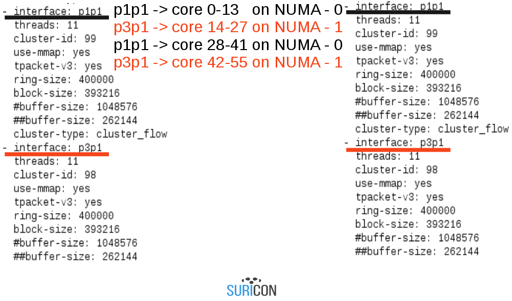

AF-packet memory consumption calculations
~~~~~~~~~~~~~~~~~~~~~~~~~~~~~~~~~~~~~~~~~

`A detailed description and a breakdown can be found in this article <http://pevma.blogspot.com/2015/10/suricata-with-afpacket-memory-of-it-all.html>`_

Memory equation (all numbers below are in bytes): ::

 <number_of_total_detection_threads> *
 <((780)+(default_packet_size))> *
 <max-pending-packets>
 
 +
 
 <defrag.memcap>
 
 +
 
 <host.memcap>
 
 +
 
 <ippair.memcap>
 
 +
 
 <flow.memcap>
 
 +
 
 <number_of_threads> * 
 <216(TcpSession structure is 192 bytes, PoolBucket is 24 bytes)> * 
 <prealloc-sessions>
 
 +
 
 [per af-packet interface enabled]
 <af-packet_number_of_threads>  * 
 <ringsize>  * 
 <((780)+(default_packet_size))>
 
 +
 
 <stream.memcap>
 
 +
 
 <stream.reassembly.memcap>
 
 +
 
 <app-layer.protocols.dns.global-memcap>
 
 +
 
 <app-layer.protocols.http.memcap>
 
 =
 Estimated total memory consumption by Suricata (+/- 1-2%)

Common misconceptions - part 3
------------------------------

- Hyperthreads on Linux must be disabled in BIOS as they harm performance. 

Hyperthreads actually helps performance, minimizing periods where entire core is 
idle waiting for packets. Who knows, maybe packet nr 205 can be processed while 
core is waiting for packet 143? Do your tests, we did not need to use HT to 
reach 20Gbit/sec, maybe it will work really well for you. It is worth trying.

- On Linux every other “core” is a HyperThread, when HT is enabled. 

That was true on kernels 2.6. Starting with 3.x and 4.x Linux first lists first 
N threads from first CPU, then from second CPU, then goes back to first CPU 
(if the machine has two CPUs). 

- Given a pair 0-28 (two threads on the same core) 0 is a real core and 28 is a hyperthread, so you should avoid scheduling anything on 28 because it will only run when 0 is idle. 

Nope, both 0 and 28 are hyperthreads from the start and which thread gets access 
to which resources is a function of internal processor’s state - none of the 
hyperthreads are favored. The generic idea behind that is - "if hyperthread 0 
does not use execution unit A then maybe hyperthread 28 could?"

- Hyperthreads divide core resources in two, yielding lower performance. 

Actually there are some duplicated resources on each core that are not used 
if you don’t use Hyperthreading.

- NUMA crosstalk is wrong because there is limited bandwidth between CPUs. 

There is plenty of bandwidth on the QPI (QuickPath Interconnect). The problem
is somewhere else - in frequent cache misses - the NIC card has already 
pre-warmed L3 on CPU 0 with data but L3 on CPU 0 will need to fetch the 
same packet over QPI, leading to the stall.

Packet Drops
------------

Packets can be dropped in multiple places. It is important to monitor all of them, otherwise you do not have an accurate description of a packet loss and that leads to missed events.

* If a span port is used, then a large packet loss can happen, especially on Junipers and older Cisco, frequently 10-20%. New Cisco switches keep the packet loss low, single digits and even below 1%.
* If a packet broker is used, such as Arista, Netoptics / Ixia xStream / xDirector, Gigamon, and similar then at the input buffer or at the output buffer
* At the card’s MAC layer if packets are malformed (ethtool -S)
* At the card’s FIFO buffer (rx_missed and no buffer count) if there is no place in the RX buffer, that leads to a FIFO content being overwritten
* At the softirq layer - kernel cannot pull packets fast enough from RX buffers and into SKB and AF_Packet - /proc/net/softnet_stat
* At the AF_Packet, if packets can’t be moved to the mmaped ring quickly enough - getsockopt(ptv->socket, SOL_PACKET, PACKET_STATISTICS, &kstats, &len)
* Finally, Suricata can drop a packet that went all through that torture, to get here, if a packet has invalid CRC

Suricata shows only the last parts and in most cases any drops there are most 
likely an indirect effect of the drops that have occurred elsewhere.

You can (and should) monitor those drops in multiple places.

|

Card’s FIFO buffer drops/losses::

 ethtool -S p1p1 | egrep 'rx_dropped|rx_missed|rx_packets|errors'

And watch the rx_dropped or rx_missed counter growing or not (depending on the card).

SoftIRQ::

 cat /proc/net/softnet_stat

Unfortunately values are in hex and documented only in the kernel source. 
Read the kernel function kernel `softnet_seq_show()` in the `kernel/net/core/net-procfs.c`
for columns description. At the moment we wrote this paper, columns were like these::

 1. Total number of frames processed
 2. Number of frames dropped
 3. Number of times softirq had more frames to process but ran out of 
 pre-configured time or the number of frames was too large. If this keeps 
 growing, than increasing the netdev_budget might help (show below).
 4. Zero
 5. Zero
 6. Zero
 7. Zero
 8. Zero (seriously)
 9. A number of times collision occurred when a transmit path tried to 
 obtain a device lock. Unimportant here.
 10. Number of inter-CPU interrupts, for kicking off processing of 
 a backlog queue on a remote CPU, used only by RPS and RFS and 
 not enabled by default 
 11. Used only by RFS, not here

There is also a script showing and translating statistics in a real time which we 
recommend - called `softnet_stats.pl <https://github.com/netoptimizer/network-testing/blob/master/bin/softnet_stat.pl>`_.

To increase the budget (if necessary)::

 sysctl -w net.core.netdev_budget=3000

(default is 300)

It’s impossible to tell what does that mean without looking at the driver code 
but by default softirq loop exits after processing 300 / 64 ~ 5 runs of the `ixgbe_poll()`
or similar function, which by default tries to dequeue 64 packets at once so 
around 320 packets. There is also another limit - 2 jiffies, so 2ms on 1000Hz 
system (which is default).

But the `ifconfig drops` counter is growing:

Ignore ifconfig - it reads counters that are hard to interpret and increased in 
the most surprising places. Here are the most common reasons (we believe all 
of them, but making a full list would mean reading entire network stack):

* The softnet backlog is full (but we already have a detailed troubleshooting described)
* Bad VLAN tags (are you sure you run with promisc on?)
* Packets received with unknown or unregistered protocols (promisc again or strange frames on the wire, ask your network admin)
* IPv6 packets when the server is configured only for ipv4 - should not be the case here, we run promisc and just sniff everything

Conclusion points
=================

* There are plenty of places where a packet drop/loss or overwrite in a buffer can occur before it is Suricata's turn to process it.
* Suricata tuning for high performance is a processes as opposed to a config copy/pasted from somewhere. 
* The tuning itself is done for the whole system - not just Suricata. 
* Test and analyze before you order that HW.

|

Performance on a tunned system under 20 Gbps sustained peaks :  

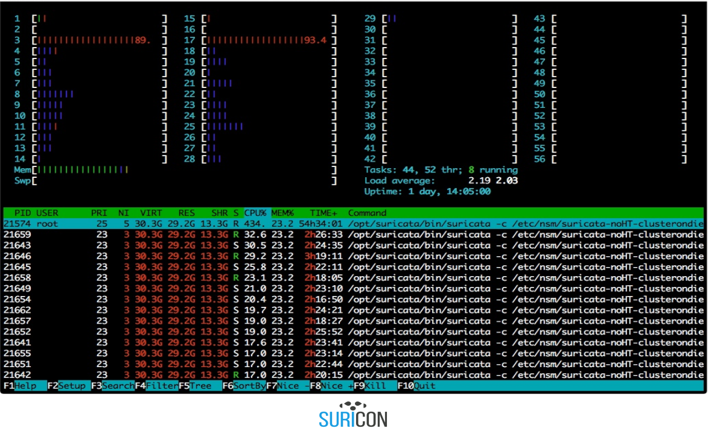

|

Drops on a tunned system under 20 Gbps sustained peaks :  

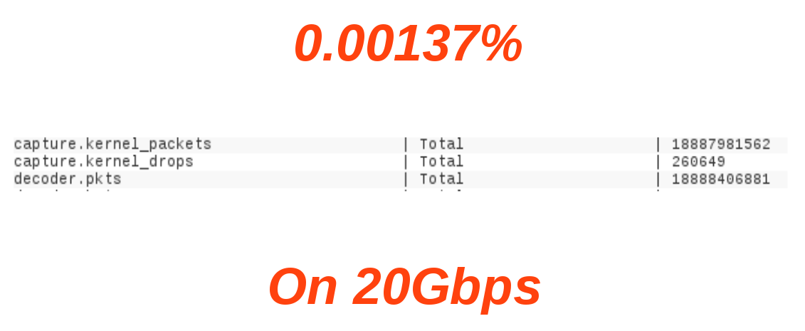

|

In mob we trust.

Authors
=======

A word about the authors:

Michal Purzynski (@MichalPurzynski) 
-----------------------------------

* Threat Management, Mozilla

Peter Manev (@pevma) 
--------------------

* Suricata Core Team
* Lead QA and training instructor
* Stamus Networks
* Mobster evangelist

Thank you
=========

People and organizations without whom this guide would have not been possible:

* Mozilla (time, traffic, hardware)
* Intel - Alexander Duyck
* Eric Leblond (@Regit – Suricata cpu affinity/local bypass) 
* Daniel Borkmann (netsniff-ng, AFPacket)
* Dave Miller for AFPacket :-)
* SuriCon 2016 !!

